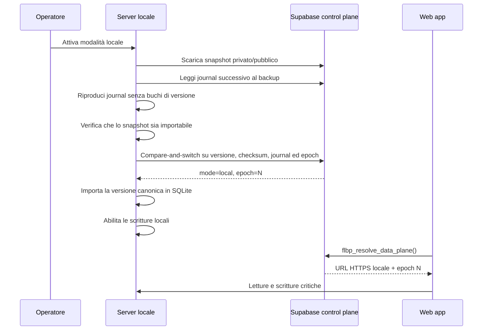
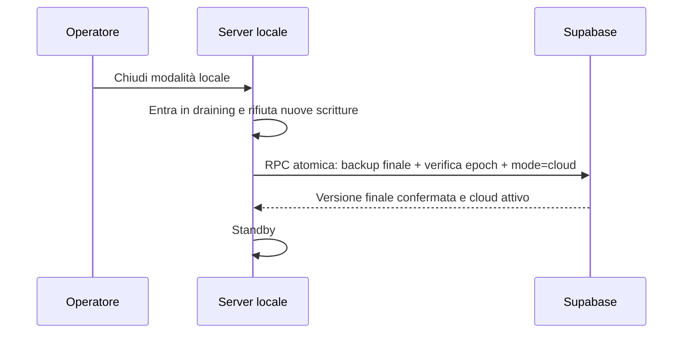

# Server locale del torneo e protocollo anti-perdita

## Confine del data plane

Quando `flbp_resolve_data_plane()` restituisce `local`, il traffico critico del torneo usa il server Windows:

- snapshot Admin privato;
- snapshot pubblico e live/TV;
- elenco e dettaglio dei tornei derivati dallo snapshot pubblico;
- autenticazione arbitri del torneo;
- referti come patch atomiche per partita.

Supabase resta il control plane e continua a gestire Auth, account giocatori, push, Fantabeerpong e dati non critici. Questi sottosistemi non vengono spostati su SQLite: replicarli in modo bidirezionale produrrebbe conflitti e indebolirebbe l’Auth. Lo snapshot `AppState` contiene comunque l’intero stato applicativo necessario a far proseguire il torneo.

## Flusso Admin locale

1. L’Admin effettua almeno una volta il login Supabase reale e viene verificato in `admin_users`.
2. Dal PC server, la web app ottiene automaticamente una sessione temporanea locale; l’endpoint la rilascia solo a richieste loopback senza header di tunnel/proxy.
3. Ogni modifica Admin viene prima salvata come bozza durevole nel browser e poi committata in SQLite con `operationId` e `baseVersion`.
   Il push attende la conferma del checkpoint locale; se nel frattempo arriva un’altra modifica, questa riceve un nuovo `operationId` e la risposta precedente non può cancellarla.
4. Lo stesso commit aggiorna nella medesima transazione snapshot privato e snapshot pubblico sanitizzato.
5. Pubblico, arbitri e TV leggono quindi la stessa versione dal server locale; dopo un riavvio WAL e versione restano invariati.
6. Durante la leadership locale la sincronizzazione normalizzata periodica verso Supabase è sospesa. Dopo la disattivazione sicura, la ricostruzione del mirror viene eseguita una sola volta dall'Admin già aperto oppure alla sua successiva apertura; lo snapshot completo è già stato caricato atomicamente dal server.

Se Internet cade o la finestra viene riaperta, l’Admin può continuare per 36 ore solo quando sono presenti insieme una sessione Supabase realmente verificata in precedenza e la sessione rilasciata dal nodo locale. Non viene introdotta una password Admin fittizia nel frontend.

## Invarianti

1. Una modifica viene registrata localmente prima di essere inviata.
2. Ogni operazione ha un ID stabile; un retry è idempotente.
3. Un commit full-state richiede la versione base corrente.
4. I referti aggiornano solo i match dichiarati e rifiutano una data referto precedente.
5. Nessuna scrittura di rete parte da `beforeunload`, `pagehide` o pagina nascosta.
6. Una finestra Admin passiva non crea nemmeno una bozza ripristinabile.
7. Supabase e server locale non sono mai scrivibili contemporaneamente per lo stesso workspace.
8. La scadenza della leadership locale produce `recovery`, non un failover cloud automatico.
9. La disattivazione locale riesce solo dopo il backup finale atomico.
10. Un nodo sostitutivo riproduce il journal remoto dopo l’ultimo backup e si arresta se manca una versione.
11. L’attivazione è un compare-and-switch: se il cloud cambia dopo il download, il nodo locale non diventa scrivibile e deve ripartire da uno snapshot aggiornato.
12. Dall’inizio della disattivazione nessuna nuova scrittura è accettata; lo stato di draining sopravvive al riavvio finché Supabase non conferma l’esito.
13. Solo la vista Admin può produrre un full-state draft; arbitri, pubblico, giocatori e TV usano endpoint dedicati e non possono ripubblicare uno snapshot parziale.
14. Se è configurato un secondo volume, un commit non viene confermato al browser finché la medesima versione non è presente anche in una copia SQLite completa e leggibile su quel volume.
15. Un elemento esce dall'outbox locale solo dopo che una RPC Supabase transazionale ha confermato l'intero batch; collisioni di `operationId`, versioni duplicate diverse e buchi bloccano il batch senza conferme parziali.
16. Un DB ripristinato da replica resta in `restore-pending`: nessuna scrittura è accettata finché Supabase non riconferma lo stesso nodo e lo stesso epoch.
17. In modalità cloud il push Admin usa una RPC v2 idempotente: lo stesso `operationId` con gli stessi dati restituisce la conferma originaria; collisioni o operazioni già superate diventano conflitti, mai overwrite.
18. Se `localStorage` esaurisce la quota ma IndexedDB ha confermato la bozza, al reload il repository rilegge il checkpoint IndexedDB, conserva il timestamp base e lo ripropone prima di scaricare lo stato remoto.
19. Il drain remoto resta attivo finché l'outbox non è vuota: una commit concorrente arrivata durante un upload viene raccolta nello stesso ciclo e non aspetta il backup dei 30 minuti.

## Sequenza di attivazione

## Sequenza di disattivazione

Se la risposta della RPC finale viene persa, il nodo resta in draining anche dopo un riavvio e ritenta la stessa operazione. Supabase riconosce il retry della medesima versione/epoch come idempotente; il nodo non torna scrivibile finché non riceve una conferma.

Con Internet assente il PC continua a conservare le modifiche in SQLite e nel journal locale, ma gli utenti esterni non possono raggiungerlo se il tunnel è caduto. Gli utenti collegati alla stessa LAN possono usare l’indirizzo locale anche se l’IP è cambiato: il server autorizza automaticamente la propria origine effettiva, continuando a respingere origini esterne non configurate. Per continuità pubblica anche senza la linea principale serve una seconda connessione Internet.

## PC non recuperabile

Se il PC è soltanto spento o riavviato, non va eseguito alcun failover: al login ripartono server e tunnel, lo stesso `node_id` riprende l’heartbeat e l’outbox viene ritentata. Se invece PC e disco sono definitivamente indisponibili, dopo la scadenza della lease l’Admin web mostra **Failover emergenza a Supabase**. L’azione richiede una sessione Admin reale, verifica l’epoch atteso e lo incrementa per revocare definitivamente il vecchio nodo.

Il failover diretto è consentito soltanto se il journal remoto non contiene versioni successive all’ultimo snapshot completo. Se le contiene, Supabase rifiuta l’azione: va avviato un server sostitutivo, che riproduce il journal con il codice applicativo e poi esegue la disattivazione normale. L’interfaccia avverte inoltre che operazioni presenti esclusivamente sul disco perso non sono recuperabili; per eliminare anche questo rischio fisico servono UPS e replica su un secondo disco/nodo.

## Ripristino verificato dal secondo disco

Il comando Windows `Ripristina backup FLBP Server.cmd` seleziona la copia più recente o una copia indicata dall'operatore. Prima di modificare il target verifica integrità SQLite, tabelle FLBP, workspace e snapshot corrente. La copia viene preparata nella cartella di destinazione, sincronizzata su disco e ricontrollata; solo dopo sostituisce atomicamente il DB. Il database precedente, `-wal` e `-shm` sono conservati in una cartella `pre-restore-*`.

Se la copia risultava attiva, il ripristino conserva nodo, epoch e outbox ma imposta `restore-pending`. Letture e ispezione restano disponibili, mentre Admin e arbitri non possono scrivere. Il pulsante **Conferma ripresa backup** effettua un heartbeat: soltanto la conferma del coordinatore riapre le scritture. Un failover già effettuato incrementa l'epoch, quindi il vecchio backup resta revocato.

## Evidenze e verifiche richieste prima dell’uso reale

- applicare la migration e verificare le RPC con una Secret key server dedicata;
- installare un Named Cloudflare Tunnel con hostname stabile;
- configurare CORS con il dominio pubblico reale;
- testare due schede Admin, un arbitro e una TV simultaneamente;
- staccare Internet durante un referto e verificare la coda;
- terminare brutalmente il processo Node, riaprirlo e verificare versione/outbox;
- ripristinare una replica su un DB di prova, verificare `restore-pending` e riconfermare l'epoch;
- interrompere il heartbeat e verificare che `flbp_resolve_data_plane()` restituisca `recovery`;
- completare backup e disattivazione, poi verificare che Supabase contenga checksum e versione locali.

“Zero perdita” è garantibile per crash del browser, timeout, retry, conflitti, rete intermittente e riavvio del processo se almeno una copia durevole sopravvive. Per coprire anche rottura fisica contemporanea del PC e assenza Internet servono UPS e replica su un secondo disco/nodo.
