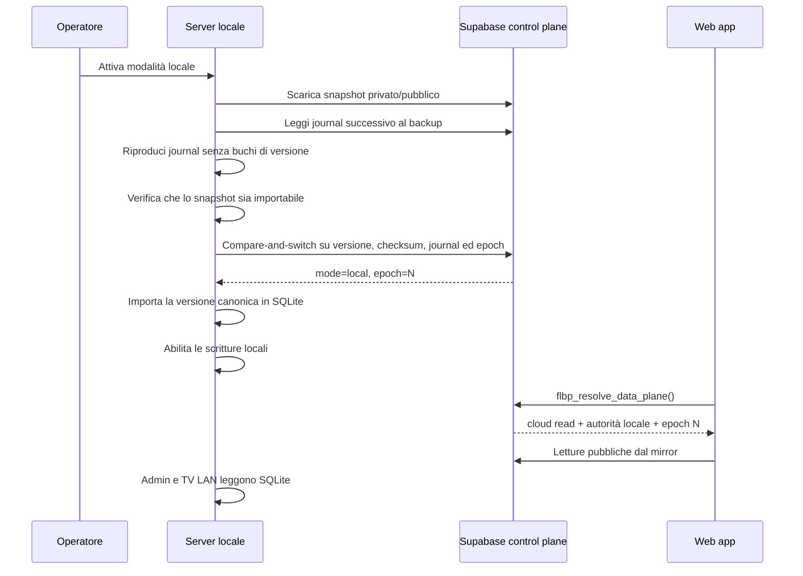
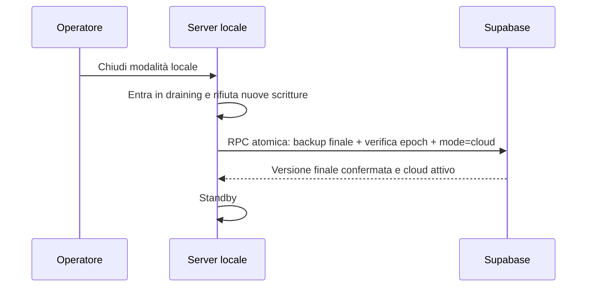

# Server locale del torneo e protocollo anti-perdita

## Confine del data plane

Il coordinatore distingue ora l'autorità di scrittura dalla sorgente delle letture pubbliche. Durante il torneo il PC è l'unico writer, mentre i client serviti direttamente dal PC scoprono il server locale sulla stessa origine:

- snapshot Admin privato;
- snapshot pubblico e live/TV aperti dal PC o dalla LAN;
- elenco e dettaglio dei tornei derivati dallo snapshot pubblico;
- autenticazione arbitri del torneo;
- referti come patch atomiche per partita.

Supabase resta il control plane e continua a gestire Auth, account giocatori, push, Fantabeerpong e dati non critici. Questi sottosistemi non vengono spostati su SQLite: replicarli in modo bidirezionale produrrebbe conflitti e indebolirebbe l’Auth. Lo snapshot `AppState` contiene comunque l’intero stato applicativo necessario a far proseguire il torneo.

I visitatori del sito Internet leggono il mirror Supabase, mentre PC e dispositivi LAN che aprono direttamente il server leggono SQLite. Dopo ogni commit il server accoda la pubblicazione del solo documento live compatto, con debounce di circa un secondo e retry periodico entro 15 secondi; durante la modalità locale i browser Internet lo rileggono ogni 12–18 secondi con jitter. La propagazione cloud resta asincrona e non influenza mai la conferma del commit locale. Un tunnel o un dominio dedicato non sono necessari; se in futuro si configura un URL HTTPS del nodo, anche i lettori Internet possono essere instradati direttamente al PC.

Nel client questa separazione è vincolante: `mode=local` indica chi può scrivere, mentre `public_read_mode=cloud` impone alle viste pubbliche Internet di leggere `public_workspace_live` su Supabase. Il client tenta l'origine locale soltanto quando il coordinatore richiede esplicitamente letture locali e fornisce una `base_url`; in questo modo un tunnel disabilitato non può far ricadere il sito su uno snapshot completo meno recente.

## Flusso Admin locale

1. L’Admin effettua almeno una volta il login Supabase reale e viene verificato in `admin_users`.
2. Dal PC server, la web app ottiene automaticamente una sessione temporanea locale; l’endpoint la rilascia solo a richieste loopback senza header di tunnel/proxy.
3. Ogni modifica Admin viene prima salvata come bozza durevole nel browser e poi committata in SQLite con `operationId` e `baseVersion`.
   Il push attende la conferma del checkpoint locale; se nel frattempo arriva un’altra modifica, questa riceve un nuovo `operationId` e la risposta precedente non può cancellarla.
4. Lo stesso commit aggiorna nella medesima transazione snapshot privato e snapshot pubblico sanitizzato.
5. Il server serializza commit e replica esterna: la scrittura successiva non parte finché stato applicativo corrente, metadati e outbox della stessa versione non sono leggibili in una copia SQLite autonoma sul supporto secondario. Lo storico versionato resta nel DB primario, perciò ogni referto replica circa il solo stato corrente invece dell'intero archivio; le letture pubbliche non vengono affamate dalla copia. Al riavvio viene riutilizzata la replica verificata della stessa versione. Admin, arbitri e TV sulla LAN leggono quindi la stessa versione dal server locale; dopo un riavvio WAL e versione restano invariati.
6. L'outbox viene accorpata per circa 15 secondi e inviata in batch limitati; il mirror pubblico compatto viene accodato dopo ogni commit e ha un retry separato ogni 15 secondi, mentre il checkpoint completo resta ogni 30 minuti. Ogni richiesta Supabase ha una deadline finita (più ampia per le transizioni); dopo un errore l'outbox resta durevole e applica backoff 5/10/20/40/60 secondi per non consumare Disk I/O con retry continui.
7. Durante la leadership locale non viene mai eseguita una ricostruzione completa periodica delle tabelle torneo. I referti aggiornano soltanto le righe della partita interessata; una modifica al catalogo generale delle squadre viene solo journalizzata e non riscrive tornei o archivi. Le sole modifiche strutturali aggiornano il torneo live, l'archiviazione aggiorna una volta le proiezioni complete e la disattivazione esegue un'ultima ricostruzione verificata prima del passaggio atomico al cloud.

Se Internet cade o la finestra viene riaperta, l’Admin può continuare per 36 ore solo quando sono presenti insieme una sessione Supabase realmente verificata in precedenza e la sessione rilasciata dal nodo locale. Non viene introdotta una password Admin fittizia nel frontend.

## Persistenza e backup: flusso operativo

La scheda **Gestione dati → Persistenza e backup** separa le operazioni quotidiane da quelle tecniche:

- **Azioni rapide** mostra lo stato comprensibile del salvataggio, permette di scaricare subito un backup JSON, verificare il collegamento e confrontare i dati di questo PC con quelli presenti su Supabase.
- **Strumenti avanzati** raccoglie le operazioni che non servono durante il normale svolgimento del torneo: restore/merge da file, snapshot manuali, recovery strutturato, migrazione, auto-sync, token tecnico, diagnostica e backup/ripristino dell’intero database applicativo.
- Il failover verso Supabase rimane un comando di emergenza e compare soltanto quando il coordinatore segnala uno stato che richiede recupero. Non va usato per risolvere un normale conflitto tra due bozze.

Lo stato principale indica sempre dove vengono confermate le scritture del torneo: **PC locale**, **Supabase** oppure **scritture sospese**. La modalità tecnica “solo su questo browser” non equivale al server locale del torneo e resta tra gli strumenti avanzati per evitare ambiguità.

## Recupero guidato di un conflitto

Il comando **Confronta PC e Supabase** non modifica alcun dato. Scarica la versione cloud corrente e mostra due riepiloghi affiancati: data e versione, torneo live, numero di squadre e partite concluse. La bozza durevole del browser resta conservata per tutta la fase di confronto.

Da questo riepilogo sono disponibili due scelte esplicite:

1. **Usa Supabase su questo PC** applica sul dispositivo lo snapshot cloud selezionato. La bozza locale viene chiusa soltanto dopo la conferma dell’operazione.
2. **Sovrascrivi Supabase con questa versione locale** rende la bozza locale una nuova versione autorevole del workspace. Il comando è volutamente distinto dalla pubblicazione ordinaria e non lascia attivo un flag di forzatura riutilizzabile da altre operazioni.

La seconda scelta richiede una doppia conferma. La finestra riepiloga di nuovo origine, destinazione e differenze principali; l’operatore deve quindi digitare esattamente **SOVRASCRIVI** prima che il pulsante finale venga abilitato. Chiudere la finestra o premere **Annulla** non modifica né la bozza né Supabase.

La sovrascrittura esplicita è disponibile soltanto con sessione Admin valida, controllo di scrittura della finestra e data plane in modalità `cloud`. In modalità `local` è bloccata perché Supabase è soltanto il mirror asincrono del server SQLite: si continua a lavorare sul PC e si usa la normale chiusura della modalità locale per il passaggio finale. In modalità `recovery` resta bloccata in fail-closed finché l’autorità del database non è stata risolta. Né la parola di conferma né il comando “forza” possono scavalcare lease, fencing o autorizzazioni.

Anche dopo il confronto viene applicato un controllo compare-and-swap: la versione di Supabase deve essere ancora quella mostrata nel riepilogo. Se un altro Admin o un referto aggiorna il DB prima della conferma finale, l’operazione viene rifiutata, la bozza rimane recuperabile e l’interfaccia richiede un nuovo confronto. “Sovrascrivi” significa quindi sostituire consapevolmente la versione appena verificata, non cancellare alla cieca una modifica concorrente.

I referti arbitro più recenti presenti nello snapshot autorevole vengono conservati. Se la bozza ha eliminato completamente una partita dotata di referto, il recupero automatico viene rifiutato e richiede l’esportazione/riconciliazione manuale: il sistema non reinserisce silenziosamente una partita in un tabellone potenzialmente diverso.

La scelta tra i due snapshot riguarda soltanto lo stato del workspace del torneo e il relativo mirror pubblico. Non modifica credenziali Supabase Auth, account giocatore, profili, squadre FantaBeerpong o altri dati Fanta: questi servizi restano nel control plane Supabase e continuano a funzionare indipendentemente dal database primario del torneo.

Per garantire questa separazione, il recupero automatico viene bloccato se la bozza locale e Supabase indicano due ID di torneo live diversi. In quel caso serve una riconciliazione esplicita: il sistema non elimina né sposta automaticamente squadre e rose Fanta legate al torneo cloud. Con ID uguale, dopo lo snapshot viene riallineata anche la proiezione normalizzata usata dalle viste Fanta/live; un errore del mirror pubblico produce un avviso ambra e mantiene la richiesta di retry, non un falso esito positivo.

## Invarianti

1. Una modifica viene registrata localmente prima di essere inviata.
2. Ogni operazione ha un ID stabile; un retry è idempotente.
3. Un commit full-state richiede la versione base corrente.
4. I referti aggiornano solo i match dichiarati e rifiutano una data referto precedente.
5. Dopo una patch referto confermata, la stessa finestra Admin avanza il proprio cursore di versione senza inviare uno snapshot completo stale; la bozza browser viene chiusa solo per quell'operazione.
6. Un `AbortError` prodotto dal reload della pagina non revoca da solo l'autorità Admin: la nuova pagina resta bloccata in acquisizione e ripete subito la verifica del lease.
5. Nessuna scrittura di rete parte da `beforeunload`, `pagehide` o pagina nascosta.
6. Una finestra Admin passiva non crea nemmeno una bozza ripristinabile.
7. Nell'app Windows il processo host assegna alla finestra un'identità stabile, reiniettata prima di ogni navigazione WebView2: un reload riprende immediatamente la propria lease senza attendere i 90 secondi del TTL. Una seconda istanza dell'app riceve invece un'identità diversa e resta correttamente in sola lettura. Un singolo heartbeat abortito viene ritentato senza bloccare una finestra che possiede ancora una lease valida; il server continua comunque a verificare `x-flbp-writer-id` su ogni commit. La rotta locale e la navigazione Admin non sensibile vengono salvate e ripristinate dopo un errore o riavvio WebView2, con stato di attesa e retry progressivi; token e password non vengono persistiti da questo meccanismo.
7. Supabase e server locale non sono mai scrivibili contemporaneamente per lo stesso workspace.
8. La scadenza della leadership locale produce `recovery`, non un failover cloud automatico.
9. La disattivazione locale riesce solo dopo il backup finale atomico.
10. Un nodo sostitutivo riproduce il journal remoto dopo l’ultimo backup e si arresta se manca una versione.
11. L’attivazione è un compare-and-switch: se il cloud cambia dopo il download, il nodo locale non diventa scrivibile e deve ripartire da uno snapshot aggiornato.
12. Dall’inizio della disattivazione nessuna nuova scrittura è accettata; lo stato di draining sopravvive al riavvio finché Supabase non conferma l’esito.
13. Solo la vista Admin può produrre un full-state draft; arbitri, pubblico, giocatori e TV usano endpoint dedicati e non possono ripubblicare uno snapshot parziale.
14. Se è configurato un secondo volume, un commit non viene confermato al browser finché la medesima versione non è presente anche in una copia SQLite completa e leggibile su quel volume.
15. Un elemento esce dall'outbox locale solo dopo che una RPC Supabase transazionale ha confermato l'intero batch; collisioni di `operationId`, versioni duplicate diverse e buchi bloccano il batch senza conferme parziali.
16. Un DB ripristinato da replica resta in `restore-pending`: nessuna scrittura è accettata finché Supabase non riconferma lo stesso nodo e lo stesso epoch.
17. In modalità cloud il push Admin usa una RPC v2 idempotente: lo stesso `operationId` con gli stessi dati restituisce la conferma originaria; collisioni o operazioni già superate diventano conflitti, mai overwrite.
18. Se `localStorage` esaurisce la quota ma IndexedDB ha confermato la bozza, al reload il repository rilegge il checkpoint IndexedDB, conserva il timestamp base e lo ripropone prima di scaricare lo stato remoto.
19. Il drain remoto resta attivo finché l'outbox non è vuota: una commit concorrente arrivata durante un upload viene raccolta nello stesso ciclo e non aspetta il backup dei 30 minuti.
20. Il processo Node registra startup, warning ed errori fatali in un log ruotato anche quando Task Scheduler lo avvia senza una console; un errore periodico del supporto secondario diventa una promise rifiutata gestita e non può terminare il server. I heartbeat Supabase lenti sono coalesciati e, dopo errori, usano backoff progressivo: non possono accumulare chiamate concorrenti mentre il database cloud è saturo.

## Sequenza di attivazione

## Sequenza di disattivazione

Se la risposta della RPC finale viene persa, il nodo resta in draining anche dopo un riavvio e ritenta la stessa operazione. Supabase riconosce il retry della medesima versione/epoch come idempotente; il nodo non torna scrivibile finché non riceve una conferma.

Con Internet assente il PC continua a conservare le modifiche in SQLite e nel journal locale. Gli utenti esterni vedono l'ultimo mirror Supabase raggiungibile; Admin e TV sulla LAN continuano a usare l’indirizzo locale anche se l’IP è cambiato. Il server autorizza automaticamente la propria origine effettiva, continuando a respingere origini esterne non configurate.

## PC non recuperabile

Se il PC è soltanto spento o riavviato, non va eseguito alcun failover: al login ripartono server e tunnel, lo stesso `node_id` riprende l’heartbeat e l’outbox viene ritentata. Se invece PC e disco sono definitivamente indisponibili, dopo la scadenza della lease l’Admin web mostra **Failover emergenza a Supabase**. L’azione richiede una sessione Admin reale, verifica l’epoch atteso e lo incrementa per revocare definitivamente il vecchio nodo.

Una perdita di rete non autorizza l'avvio di un secondo PC: il vecchio writer potrebbe continuare a salvare offline. Il server sostitutivo può essere attivato soltanto dopo spegnimento fisico/revoca del primario e non deve ricevere una copia manuale della cartella `data`, perché essa duplicherebbe identità del nodo, epoch e outbox. Il passaggio corretto usa il ripristino verificato descritto sotto.

Il failover diretto è consentito soltanto se il journal remoto non contiene versioni successive all’ultimo snapshot completo. Se le contiene, Supabase rifiuta l’azione: va avviato un server sostitutivo, che riproduce il journal con il codice applicativo e poi esegue la disattivazione normale. L’interfaccia avverte inoltre che operazioni presenti esclusivamente sul disco perso non sono recuperabili; per eliminare anche questo rischio fisico servono UPS e replica su un secondo disco/nodo.

## Ripristino verificato dal secondo disco

Il comando Windows `Ripristina backup FLBP Server.cmd` seleziona la copia più recente o una copia indicata dall'operatore. Prima di modificare il target verifica integrità SQLite, tabelle FLBP, workspace e snapshot corrente. La copia viene preparata nella cartella di destinazione, sincronizzata su disco e ricontrollata; solo dopo sostituisce atomicamente il DB. Il database precedente, `-wal` e `-shm` sono conservati in una cartella `pre-restore-*`.

Se la copia risultava attiva, il ripristino conserva nodo, epoch e outbox ma imposta `restore-pending`. Letture e ispezione restano disponibili, mentre Admin e arbitri non possono scrivere. Il pulsante **Conferma ripresa backup** effettua un heartbeat: soltanto la conferma del coordinatore riapre le scritture. Un failover già effettuato incrementa l'epoch, quindi il vecchio backup resta revocato.

## Evidenze e verifiche richieste prima dell’uso reale

- applicare la migration e verificare le RPC con una Secret key server dedicata;
- verificare che il sito pubblico continui a leggere Supabase mentre il PC possiede la leadership;
- verificare Admin e TV dalla LAN con il tunnel disattivato;
- testare due schede Admin, un arbitro e una TV simultaneamente;
- staccare Internet durante un referto e verificare la coda;
- terminare brutalmente il processo Node, riaprirlo e verificare versione/outbox;
- ripristinare una replica su un DB di prova, verificare `restore-pending` e riconfermare l'epoch;
- interrompere il heartbeat e verificare che `flbp_resolve_data_plane()` restituisca `recovery`;
- completare backup e disattivazione, poi verificare che Supabase contenga checksum e versione locali.
- eseguire `Verifica prontezza FLBP Server.cmd` e controllare anche ACL di `.env`, database e replica, più la presenza della RPC journal v2 effettivamente usata dal runtime.

“Zero perdita” è garantibile per crash del browser, timeout, retry, conflitti, rete intermittente e riavvio del processo se almeno una copia durevole sopravvive. Per coprire anche rottura fisica contemporanea del PC e assenza Internet servono UPS e replica su un secondo disco/nodo.
